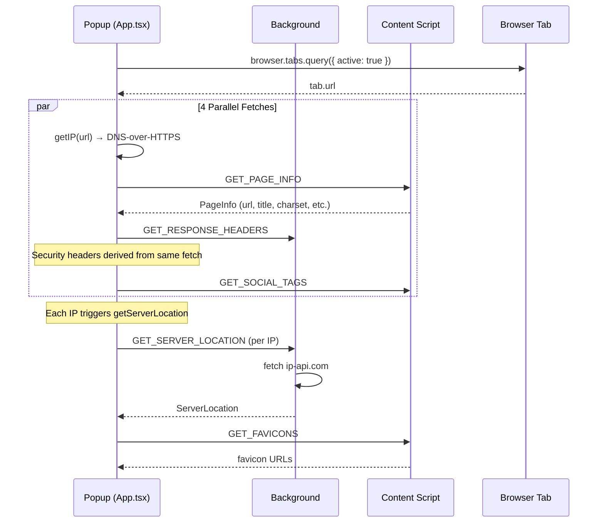
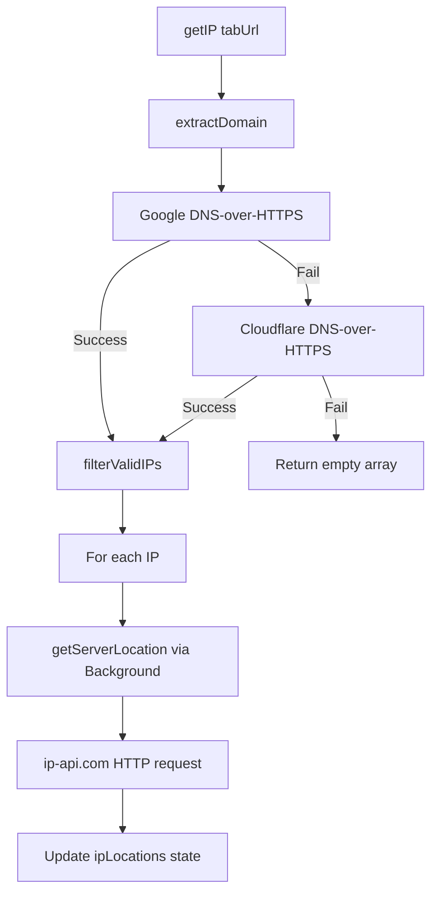
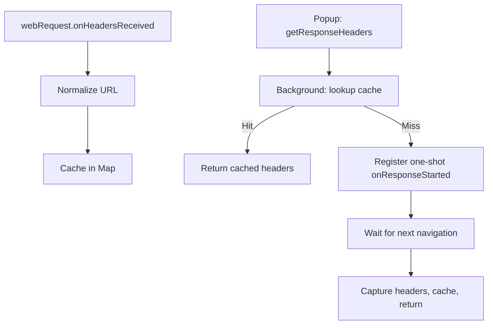

# Glim Architecture

## Extension Architecture

Glim follows the standard WebExtension three-layer architecture, orchestrated by the WXT framework.

```
┌─────────────────────────────────────────────────────────────────┐
│                        Browser Tab                              │
│  ┌───────────────────────────────────────────────────────────┐  │
│  │ Content Script (content.ts)                               │  │
│  │ - Extracts page info (URL, title, charset, etc.)          │  │
│  │ - Extracts social meta tags from DOM                      │  │
│  │ - Extracts favicons from <link> elements                  │  │
│  │ - Listens for messages from popup                         │  │
│  └───────────────────────────────────────────────────────────┘  │
└─────────────────────────────────────────────────────────────────┘
         │ browser.tabs.sendMessage                ▲
         ▼                                         │
┌─────────────────────────────────────────────────────────────────┐
│                    Popup (React App)                            │
│  ┌───────────────────────────────────────────────────────────┐  │
│  │ App.tsx — orchestrator                                    │  │
│  │ - Queries active tab URL                                  │  │
│  │ - Fires 4 parallel fetches                                │  │
│  │ - Manages all loading/error state                         │  │
│  └───────────────────────────────────────────────────────────┘  │
│  ┌───────────────────────────────────────────────────────────┐  │
│  │ Components: GlowCard, ServerLocationCard, PageInfoCard,   │  │
│  │ SecurityCard, SocialTagsCard, HeadersCard, MapChart       │  │
│  └───────────────────────────────────────────────────────────┘  │
└─────────────────────────────────────────────────────────────────┘
         │ browser.runtime.sendMessage              ▲
         ▼                                         │
┌─────────────────────────────────────────────────────────────────┐
│               Background Service Worker                         │
│  - Captures HTTP response headers via webRequest API            │
│  - Caches headers by normalized URL in Map                      │
│  - Proxies ip-api.com calls (avoids CORS)                       │
└─────────────────────────────────────────────────────────────────┘
         │ fetch()                                 ▲
         ▼                                         │
┌─────────────────────────────────────────────────────────────────┐
│                    External APIs                                │
│  - Google DNS-over-HTTPS (dns.google)                           │
│  - Cloudflare DNS-over-HTTPS (cloudflare-dns.com)               │
│  - ip-api.com (IP geolocation)                                  │
└─────────────────────────────────────────────────────────────────┘
```

## Data Flow

### Popup Initialization

When the popup opens, `App.tsx` executes `fetchAllData()`:



### IP Resolution Flow



### Response Headers Flow



### Content Script Data Flow

```mermaid
flowchart TD
    A[Popup: getPageInfo] --> B[GET_PAGE_INFO → Content Script]
    B --> C[Read window.location, document.title, etc.]
    C --> D[Return PageInfo]

    E[Popup: getSocialTagsFromContent] --> F[GET_SOCIAL_TAGS → Content Script]
    F --> G[document.querySelector for meta tags]
    G --> H[Return 24 fields: OG, Twitter, basic]

    I[Popup: getMainFavicon] --> J[GET_FAVICONS → Content Script]
    J --> K[Query 12 link selectors]
    K -->|Found| L[Return favicon URLs]
    K -->|Empty| M[Probe default paths]
    M --> N[/favicon.ico, /favicon.png, etc.]
```

## Message Passing Protocol

### Message Types

| Message | Direction | Request | Response |
|---------|-----------|---------|----------|
| `GET_RESPONSE_HEADERS` | Popup → Background | `{ type, data: { url } }` | `{ success, headers }` |
| `GET_SERVER_LOCATION` | Popup → Background | `{ type, data: { ip } }` | `{ success, data: ServerLocation }` |
| `GET_PAGE_INFO` | Popup → Content | `{ type }` | `{ success, data: PageInfo }` |
| `GET_SOCIAL_TAGS` | Popup → Content | `{ type }` | `{ success, data: SocialTagResult }` |
| `GET_FAVICONS` | Popup → Content | `{ type }` | `{ success, data: string[] }` |

All messages use the `type` key and return `{ success, data }` or `{ success, headers }`.

### Async Response Pattern

Background handlers return `true` from `onMessage` to indicate async `sendResponse`:

```typescript
browser.runtime.onMessage.addListener((message, sender, sendResponse) => {
  if (message.type === 'GET_SERVER_LOCATION') {
    fetchServerLocation(message.data.ip)
      .then(result => sendResponse(result))
      .catch(error => sendResponse({ success: false, error: error.message }));
    return true; // async sendResponse
  }
});
```

## State Management

All state lives in `App.tsx` using React hooks. No external state library.

### State Shape

```typescript
// Loading flags (6 independent)
LoadingState { url, ip, pageInfo, headers, security, socialTags }

// IP data (array, one per resolved IP)
IpLocationInfo { ip: string, location: ServerLocation | null, loading: boolean, error?: string }

// Other state
currentUrl: string
faviconUrl: string | null
pageInfo: PageInfo | null
headers: Record<string, string> | null
security: SecurityHeaders | null
socialTags: SocialTagResult | null
selectedIpIndex: number
error: string
hasFetched: boolean
themeMode: 'light' | 'dark' | 'system'
```

### State Flow

```
fetchAllData() called on mount
  ├── Reset all state
  ├── Set url loading = true
  ├── Query active tab → set currentUrl
  ├── Set all fetch loadings = true
  ├── Promise.all([fetchIP, fetchPageInfo, fetchHeadersAndSecurity, fetchSocialTags])
  │   ├── Each fetch: try { setState(result) } catch { console.error } finally { setLoading(false) }
  │   ├── fetchHeadersAndSecurity: single getResponseHeaders call, derives SecurityHeaders from result
  │   └── fetchIP also triggers per-IP location resolution
  └── Set hasFetched = true
```

## Theme System

### CSS Variable Architecture

```
:root (dark default)
├── --color-bg: #0d0d0d
├── --color-fg: #e0e0e0
├── --color-muted: #777777
├── --color-border: #333333
├── --color-accent: #88c0d0
└── --color-hover: #222222

:root.light-theme
├── --color-bg: #f8f8f8
├── --color-fg: #1a1a1a
├── --color-muted: #666666
├── --color-border: #d0d0d0
├── --color-accent: #4a7a8c
└── --color-hover: #e8e8e8

@media (prefers-color-scheme: light) and :root:not(.dark-theme)
└── Same as light-theme (system preference)
```

### Theme Toggle Cycle

```
system → light → dark → system
```

- `system`: No class on `<html>`, follows `prefers-color-scheme` media query
- `light`: `.light-theme` class on `<html>`, persisted to `localStorage('theme')`
- `dark`: `.dark-theme` class on `<html>`, persisted to `localStorage('theme')`

Theme initialization runs in `main.tsx` before React mounts to prevent flash.

## Animation System

### ScrambleText (text decode effect)

Character-by-character "decoding" animation. Each tick (40ms) reveals one more real character while the rest remain random.

- **Triggers**: `autoPlay` (mount), `externalTrigger` (rising edge), `onHover` (mouseenter)
- **Character sets**: Latin (`!@#$%^&*...`) or Chinese (`天地玄黄宇宙洪荒...`)
- **Used in**: GlowCard titles, header "GLIM" text

### CharScan (per-character color scan)

Splits text into `<span>` elements with staggered `--char-index` CSS variable. On trigger, each character animates through: muted → accent+glow → white, with 40ms delay per character.

- **Used in**: KeyValueRow labels, ServerLocationCard info rows (on hover)

### GlowCard Border Animation

SVG `<path>` traces the card perimeter. Uses `stroke-dasharray`/`stroke-dashoffset` for draw-on effect:
- **Enter**: `stroke-dashoffset` transitions from `perimeter` to `0` over 0.8s
- **Exit**: Reverses over 0.3s with 0.3s delay
- Path starts after the title bar position, creating a visual break

### CRT Overlay Effects

Four layered overlays (all `pointer-events: none`):

| Layer | z-index | Effect |
|-------|---------|--------|
| `.crt-curve-container` | 9990 | Radial gradient vignette |
| `.crt-scanlines` | 9992 | Horizontal line pattern + rolling bright band |
| `.crt-noise` | 9993 | Dot pattern with jitter animation |
| `.crt-flicker` | 9994 | Subtle opacity oscillation (0.98-1.0) |

Note: CRT classes are defined in CSS but not currently used in the JSX. The `.scanline` effect is the only one actively rendered.

### Other Animations

- **Status indicator pulse**: Opacity 1→0.4→1 over 2s, with box-shadow glow
- **Arrow enter/exit**: 360° rotation + scale bounce for link hover effects
- **Tag colors**: `.tag-success` (accent), `.tag-warning` (#fabd2f), `.tag-error` (#ff5555)

## Tailwind v4 Integration

### Setup

```typescript
// wxt.config.ts
import tailwindcss from "@tailwindcss/vite";
vite: () => ({ plugins: [tailwindcss()] })
```

### @theme Block

```css
@import "tailwindcss";

@theme {
  --font-display: 'Orbitron', sans-serif;
  --font-mono: 'JetBrains Mono', 'Share Tech Mono', monospace;
}
```

Registers `font-display` and `font-mono` as Tailwind utility classes.

### Usage Patterns

Components use CSS variables via Tailwind's arbitrary value syntax:
- `bg-[var(--color-bg)]`, `text-[var(--color-accent)]`, `border-[var(--color-border)]`
- Opacity modifiers: `bg-[var(--color-accent)]/10`
- Fixed values: `min-w-[360px]`, `text-[10px]`, `gap-[8px]`

## External API Integrations

| API | Endpoint | Purpose | Called From |
|-----|----------|---------|-------------|
| Google DNS | `https://dns.google/resolve?name={domain}&type=A` | DNS resolution | Popup (10s timeout) |
| Cloudflare DNS | `https://cloudflare-dns.com/dns-query?name={domain}&type=A` | DNS fallback | Popup (10s timeout) |
| ip-api.com | `http://ip-api.com/json/{ip}?fields=...` | IP geolocation | Background (CORS bypass) |

## Known Limitations

1. **ip-api.com over HTTP**: Free tier limitation — data transmitted unencrypted.
